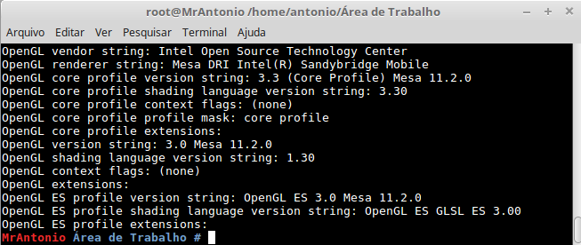

# Instalação OpenGL e SOIL - Linux Min

Este tutorial tem como obejtivo facilitar a instalação da biblioteca OpenGL, já incluindo a SOIL, que possibilita a
utilização de textura e outras funções interesantes.

## Passo a passo

1. Acesse o [código do shell script](https://raw.githubusercontent.com/antonioaads/open_GL/master/openGL_withSOIL.sh).
2. Salve esse cógigo em sua máquina (Ctrl+s), na extensão **nome_que_desejar.sh**

3. Abra o terminal (Ctrl+Alt+t).
4. Entre no diretório onde salvou o arquivo **nome_que_desejar.sh**
  - Exemplo, caso tenha salvado na área de trabalho, execute: **cd Área\ de\ Trabalho/** 
  
5. Já no diretório onde se encontra o shell script, execute: **chmod +x nome_que_desejar.sh**
  - Tal comando serve para tornar o script executável.
  
6. Entre no modo super administrador com o comando **sudo su** e digite sua senha.
  
7. Agora, finalmente, é só executar o shell script, através do comando: **./nome_que_desejar.sh**
  
8. Aguarde uma série de status.
  
9. Assim que terminar, teremos uma tela semelhante a abaixo:
  
10. Pronto.

## Testando o ambiente - OpenGL

Para testar se o ambiente está funcionando, você deve usar o programa
`quadrado.c`. Siga os passos:

1. Baixar o [código fonte](https://raw.githubusercontent.com/antonioaads/open_GL/master/testeopenGL) e salvá-lo com extensão  **nome_que_desejar.c**
1. Compilar com o seguinte comando no terminal: **gcc nome_que_desejar.c -lglut -lGL -lGLEW -lGLU**
  - Caso queira um executável com nome diferente de `a.out`, utilize: **gcc nome_que_desejar.c -lglut -lGL -lGLEW -lGLU -o nome_do_executavel**
1. Executar utilizando: **./a.out**.
  - Caso tenha usado um nome específico para o executável, utilize: **./nome_do_executavel**

O programa deve compilar e executar corretamente, gerando o seguinte resultado:

## Testando o ambiente - SOIL

Para testar se o ambiente está funcionando, você deve usar o programa
`testeSOIL.c`. Siga os passos:

1. Baixar o [código fonte](https://raw.githubusercontent.com/antonioaads/open_GL/master/testeSOIL) e salvá-lo com extensão  **nome_que_desejar.c**
1. Compilar com o seguinte comando no terminal: **gcc nome_que_desejar.c -lSOIL -lglut -lGL -lGLEW -lGLU**
  - Caso queira um executável com nome diferente de `a.out`, utilize: **gcc nome_que_desejar.c -lSOIL -lglut -lGL -lGLEW -lGLU -o nome_do_executavel**
1. Executar utilizando: **./a.out**.
  - Caso tenha usado um nome específico para o executável, utilize: **./nome_do_executavel**

O programa deve compilar e executar corretamente, gerando o seguinte resultado:

